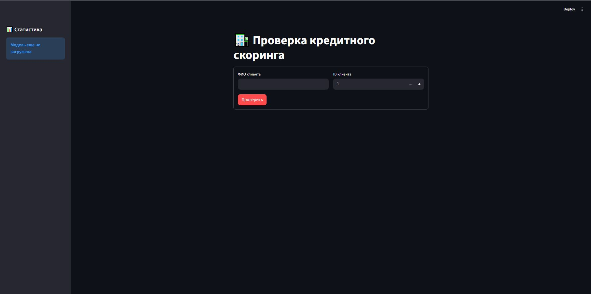
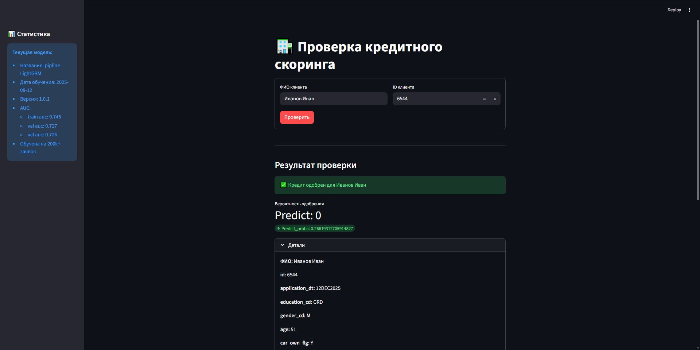
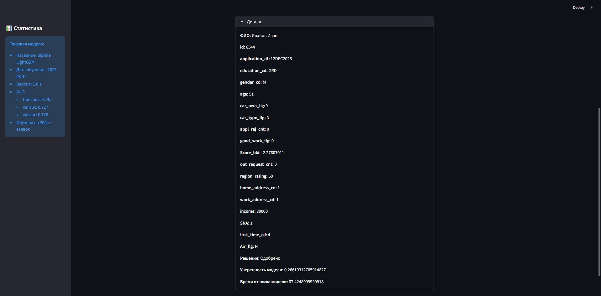

[](https://python.org)
[](https://fastapi.tiangolo.com)
[](https://streamlit.io)
[](https://docker.com)

# 🏦 Кредитный скоринг - ML проект

**Проект по предсказанию дефолта по кредитным заявкам**

---

## 📖 История проекта

### 🎯 Проблема
Банк теряет деньги из-за дефолтов по кредитам. Традиционные методы оценки неэффективны на больших объемах данных.

### 💡 Идея
Создать ML-модель, которая:
- Автоматически оценивает риск дефолта
- Работает в реальном времени через API
- Имеет интерфейс для кредитных аналитиков

### 📊 Данные
- **Источник:** Kaggle
- **Объем:** 200k+ заявок
- **Признаки:** 18
- **Целевая переменная:** Дефолт (1) / Погашение (0)

Про анализ данных и их обработку написал [здесь](data/README.md).

---

## 🏆 Достижения

| Что сделал | Результат |
|------------|-----------|
| **EDA и feature engineering** | Выявил сезонность и важность кварталов |
| **Обучение моделей** | Выбрал LightGBM (AUC 0.728) |
| **Оптимизация гиперпараметров** | Подбор через Optuna |
| **Калибровка порога** | Нашел баланс между precision и recall |
| **Развертывание API** | Реализовал FastAPI + Streamlit |
| **Контейнеризация** | Упаковал проект в Docker |

**Ключевые метрики:**
- **ROC-AUC:** 0.728
- **Время предсказания:** 40-50ms
- **Дисбаланс классов:** 80/20 успешно обработан

---

## 🚀 Быстрый старт

```bash
# Клонирование
git clone https://github.com/ваш-логин/credit-scoring.git
cd credit-scoring

# Установка зависимостей
pip install -r requirements.txt

# Запуск
docker-compose up --build
```
Доступно по адресам:  
- Streamlit интерфейс: http://localhost:8501  
- FastAPI API: http://localhost:8000/docs

---

## 📸 Демонстрация работы

<div>
<div align="center" style="display: flex; justify-content: center; gap: 20px; margin: 20px 0;">
  <div style="text-align: center;">
    <p><strong>Streamlit интерфейс</strong></p>
  </div>
  <div style="text-align: center;">
    
    <p>Главная страница</p>
  </div>
  <div align="center" style="text-align: center;">
    
    <p>Прогноз модели</p>
  </div>
  <div align="center" style="text-align: center;">
    
    <p>Информация о клиенте</p>
  </div>
</div>

---

## 📁 Структура проекта
```text
CreditScoringSystem/
├── config/              # Настройки модели
├── data/                # Данные (сырые и обработанные)
├── model/               # Сохраненные модели
├── notebooks/           # Исследование (EDA, обучение)
├── src/
│   ├── backend/        # FastAPI приложение
│   ├── frontend/       # Streamlit интерфейс
│   ├── ml/             # ML пайплайны
│   └── tools/          # Утилиты (время, YAML)
├── tests/              # Unit-тесты
├── docker-compose.yml  # Docker Compose
├── Dockerfile          # Docker образ
├── requirements.txt    # Зависимости
└── README.md           # Документация
```
---

## 🛠️ Технологии  
Машинное обучение:
- LightGBM (вместо XGBoost/CatBoost) - быстрее обучается
- Scikit-learn - предобработка и baseline модели
- Optuna - оптимизация гиперпараметров
- Joblib - сохранение моделей (лучше pickle для pipeline)

Веб и инфраструктура:
- FastAPI (вместо Flask/Django) - автодокументация
- Streamlit - быстрый прототип интерфейса
- Docker + Docker Compose - контейнеризация
- SQLite - локальная БД для демо

Разработка:
- Python 3.10+ - основной язык
- Pandas/NumPy - обработка данных
- Pytest - тестирование

---

## 📊 Об использовании данных из базы
- Данные хранятся в sqlite базе данных.  
- Когда пользователь подает заявку на кредит, он пишет свой идентификатор (аналог личных данных).  
- Далее сервис идет в базу данных и ищет информацию о клиенте на основе идентификатора.  
- Потом данные прогоняются через модель и выдается предсказание.  

---

## 🤖 Моделирование
Пробовал модели:
- LogisticRegression - baseline (AUC=0.716)
- LightGBM - быстро обучается (AUC=0.728)

Выбор LightGBM потому что:
- Быстро обучается
- Поддержка GPU для масштабирования

Pipline модели:
<div>
  <div align="center" style="text-align: center;">
    
  </div>
</div>

- OutlierTransformer - класс для обработки признаков с выбросами
- TimeTransformer - класс для обработки колонки с временем
- passthrough - признаки, которые остаются неизменными 

---

## 🎯 Оптимизация порога
Дилемма c Precision/Recall.
При стандартном пороге (0.5) следующие результаты:
```text
Threshold = 0.5
Precision (дефолт): 0.17 😱
Recall (дефолт): 0.81 👍
```
После подбора порога:
```text
Threshold = 0.75
Precision (дефолт): 0.35 ⬆️
Recall (дефолт): 0.40 ⬇️
```
*Компромисс: лучше precision ценой recall!*

Бизнес-эффект:
- Увеличил точность отказов с 17% до 35%
- Сократил ложные отказы
- Время обработки заявки: 50мс vs 5 минут у человека
---

## 📊 Результаты
Метрики финальной модели:
| Метрика	| Значение |
| ------- | -------- |
| ROC-AUC	| 0.728	   |
| Precision (класс 1) |	0.35 | 
| Recall (класс 1) | 0.40 | 
| Inference time | 40-50ms | 

