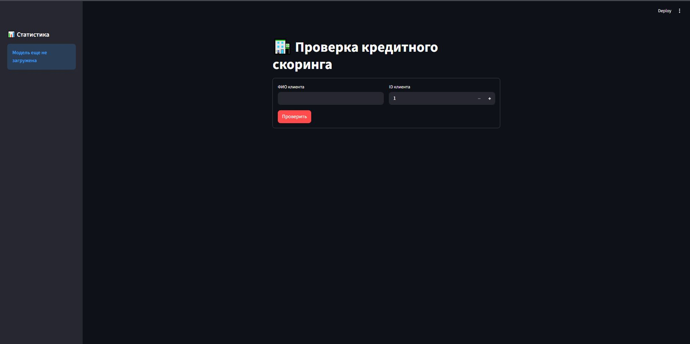
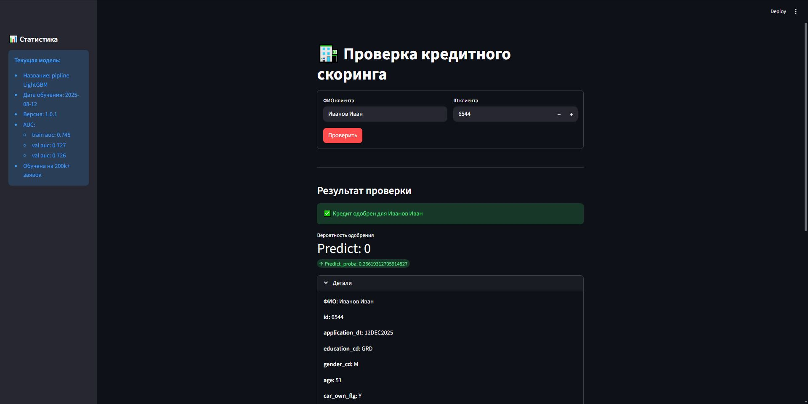
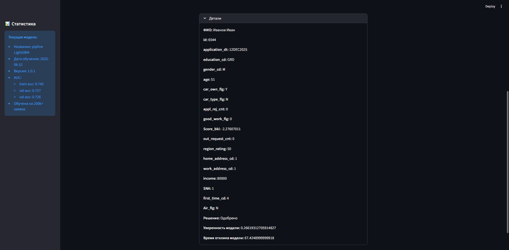

Кредитный скоринг
==============================

**Проект по предсказанию дефолта по кредитным заявкам**

## Проблема
Банк теряет деньги из-за дефолтов по кредитам. Традиционные методы оценки неэффективны на больших объемах данных.

## Идея
Создать ML-модель, которая:
- Автоматически оценивает риск дефолта
- Работает в реальном времени через API
- Имеет интерфейс для кредитных аналитиков

## Данные
- **Источник:** Kaggle
- **Объем:** 200k+ заявок
- **Признаки:** 18
- **Целевая переменная:** Дефолт (1) / Погашение (0)

Про анализ данных и их обработку написал [здесь](data/README.md).


---

## Архитектура решения
Проект построен с разделением на offline-обучение и online-инференс:
| Компонент | Назначение |
|------------|-----------|
| **Обучение** | Jupyter/скрипты для EDA, feature engineering, настройки модели |
| **ML-сервис** | FastAPI для синхронного инференса (REST API) |
| **Интерфейс** | Streamlit-дашборд для тестирования и демонстрации |
| **Упаковка** | Docker Compose для локального развертывания |

---

## Достижения

| Что сделал | Результат |
|------------|-----------|
| **EDA и feature engineering** | Выявил сезонность и значимость временных признаков (квартал, месяц) |
| **Обучение и сравнение моделей** | Выбрал LightGBM (AUC 0.728) против Logistic Regression (AUC 0.716) |
| **Оптимизация гиперпараметров** | Настроил через Optuna |
| **Калибровка порога** | Нашел баланс между precision и recall под бизнес-цель (минимизация дефолтов) |
| **Деплой** | Реализовал REST API на FastAPI + веб-интерфейс на Streamlit |
| **Контейнеризация** | Упаковал сервис в Docker, настроил взаимодействие компонентов через docker-compose |

**Ключевые метрики:**
- **ROC-AUC:** 0.728
- **Время предсказания:** 40-50ms
- **Дисбаланс классов:** 80/20 обработан с помощью взвешивания


---


## Структура проекта
```text
Credit_scoring/
├── config/              # Настройки модели
├── data/                # Данные (сырые и обработанные)
├── model/               # Сохраненные модели
├── notebooks/           # Исследование (EDA, обучение)
├── src/
│   ├── backend/        # FastAPI приложение
│   ├── frontend/       # Streamlit интерфейс
│   ├── ml/             # ML пайплайны
│   └── tools/          # Утилиты (время, YAML)
├── tests/              # Unit-тесты
├── docker-compose.yml  # Docker Compose
├── Dockerfile          # Docker образ
├── requirements.txt    # Зависимости
└── README.md           # Документация
```


---


## Технологии  
Машинное обучение:
- LightGBM (вместо XGBoost/CatBoost) - быстрее обучается
- Scikit-learn - предобработка и baseline модели
- Optuna - оптимизация гиперпараметров
- Joblib - сохранение моделей (лучше pickle для pipeline)

Веб и инфраструктура:
- FastAPI (вместо Flask/Django) - автодокументация
- Streamlit - быстрый прототип интерфейса
- Docker + Docker Compose - контейнеризация
- SQLite - локальная БД для демо

Разработка:
- Python 3.10+ - основной язык
- Pandas/NumPy - обработка данных
- Pytest - тестирование


---


## Моделирование
### Сравнение моделей:
| Модель | AUC | Комментарий |
|------------|-----------|-----------|
| **LogisticRegression** | 0.716 | Baseline |
| **LightGBM** | 728 | Выбран для продакшна |

Выбор LightGBM потому что:
- Быстро обучается
- Поддержка GPU

### ML-пайплайн:
<div>
  <div align="center" style="text-align: center;">
    
  </div>
</div>

- OutlierTransformer - класс для обработки признаков с выбросами
- TimeTransformer - класс для обработки колонки с временем
- passthrough - признаки, которые остаются неизменными 


---


## Оптимизация порога
Дилемма c Precision/Recall.
При стандартном пороге (0.5) следующие результаты:
```text
Threshold = 0.5
Precision (дефолт): 0.17
Recall (дефолт): 0.81
```
После подбора порога:
```text
Threshold = 0.75
Precision (дефолт): 0.35
Recall (дефолт): 0.40
```
Компромисс: повысили точность выявления рискованных заемщиков за счет чувствительности.  
Для бизнеса это означает меньше ложных отказов добросовестным клиентам при сохранении контроля над дефолтами.  

---


## Результаты
Метрики финальной модели:
| Метрика	| Значение |
| ------- | -------- |
| ROC-AUC	| 0.728	   |
| Precision (класс 1) |	0.35 | 
| Recall (класс 1) | 0.40 | 
| Inference time | 40-50ms | 


---


## Демонстрация работы

<div>
<div align="center" style="display: flex; justify-content: center; gap: 20px; margin: 20px 0;">
  <div style="text-align: center;">
    <p><strong>Streamlit интерфейс</strong></p>
  </div>
  <div style="text-align: center;">
    
    <p>Главная страница</p>
  </div>
  <div align="center" style="text-align: center;">
    
    <p>Прогноз модели</p>
  </div>
  <div align="center" style="text-align: center;">
    
    <p>Информация о клиенте</p>
  </div>
</div>


---


## Быстрый старт

```bash
# Клонирование
git clone https://github.com/w0drs/credit-scoring.git
cd credit-scoring

# Установка зависимостей
pip install -r requirements.txt

# Запуск
docker-compose up --build
```
Доступно по адресам:  
- Streamlit интерфейс: http://localhost:8501  
- FastAPI API: http://localhost:8000/docs


