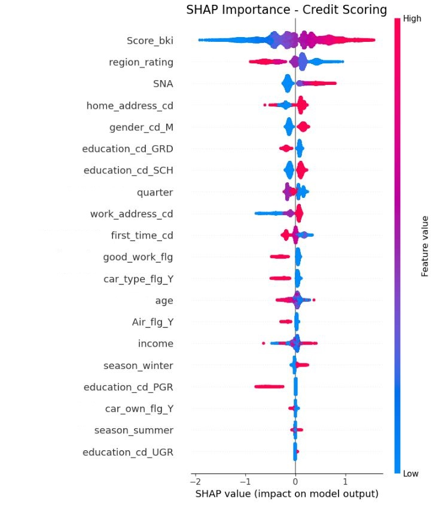

EDA, обработка данных
==============================

## 📁 О данных
- **Источник:** Kaggle
- **Объем:** 200k+ заявок
- **Признаков:** 18

### 📋 Два исходных датасета:
1. **`Application_info.csv`** - признаки заявок
2. **`Default_flg.csv`** - целевая переменная (дефолт)

### 🏷️ Все колонки:
| Колонка | Описание |
|---------|----------|
| `id` | Анонимизированный ID заявителя |
| `application_dt` | Дата подачи заявки |
| `sample_cd` | Категория выборки |
| `education_cd` | Образование |
| `gender_cd` | Пол |
| `age` | Возраст |
| `car_own_flg` | Наличие автомобиля |
| `car_type_flg` | Наличие иномарки |
| `appl_rej_cnt` | Количество отказов в прошлом |
| `good_work_flg` | "Хорошая" работа |
| `score_bki` | Скор-балл БКИ |
| `out_request_cnt` | Запросы в БКИ |
| `region_rating` | Рейтинг региона |
| `home_address_cd` | Домашний адрес |
| `work_address_cd` | Рабочий адрес |
| `income` | Доход |
| `SNA` | Связи с клиентами |
| `first_time_cd` | Давность информации |
| `air_flg` | Загранпаспорт |
| `default_flg` | Дефолт по кредиту |

## 🔍 EDA - что обнаружил?

### 🚨 Проблемы в данных:
- **Пропуски** в `education_cd`
- **Сильный дисбаланс** классов (1:8) 
- **Выбросы** в `appl_rej_cnt` и `out_request_cnt`

### 📊 Матрица корреляции:

  

    
  

*Низкая корреляция между признаками - хорошо для моделей!*

## ⚙️ Преобразование данных

### 🧹 Очистка:
- `education_cd` → заполнил **модой** (пропусков мало)
- `appl_rej_cnt` → бинарный признак `>5`
- `out_request_cnt` → бинарный признак `>10`

### 🔄 Кодирование:
- One-Hot Encoding: `education_cd`, `gender_cd`, `car_own_flg`, `car_type_flg`, `Air_flg`
- StandardScaler: `age`, `income`, `region_rating`

### 📅 Временные признаки:
Из `application_dt` создал:
- **Сезоны** (Лето/Зима/Весна/Осень)
- **Кварталы года**

**Инсайт:** **Кварталы оказались важнее месяцев!**  
**Открытие:** **Зимой риск дефолта выше на 15%**

## 🏆 Важность признаков (SHAP)

  

### 🥇 Топ-3 важных признаков:
1. **`score_bki`** - кредитная история 
2. **`region_rating`** - регион
3. **`SNA`** - связи

### 💡 Ключевой вывод:
**Созданные временные признаки (сезон, квартал) стали одними из важных**  
Это подтверждает гипотезу о сезонности кредитных рисков.

